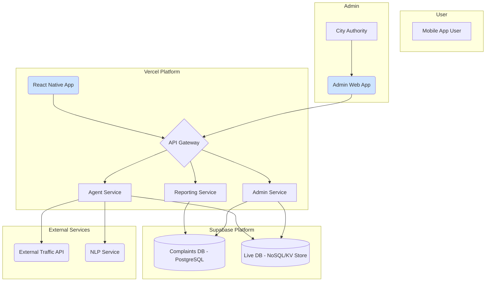
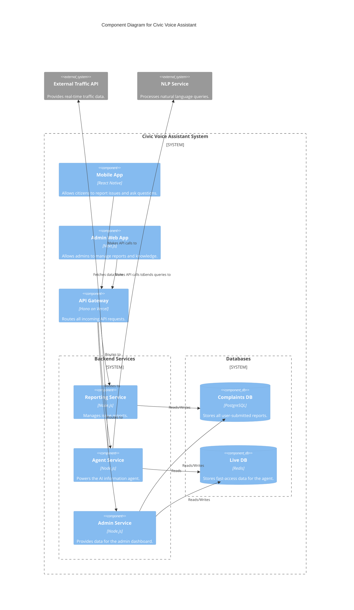
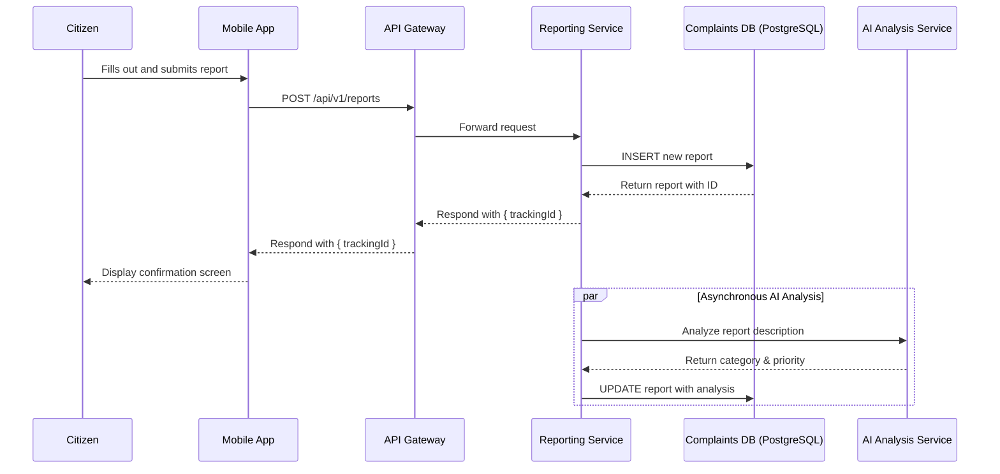
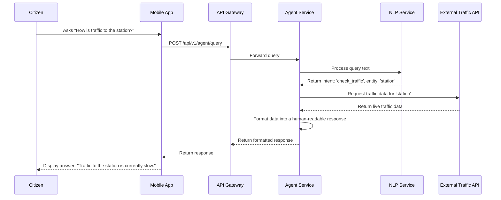
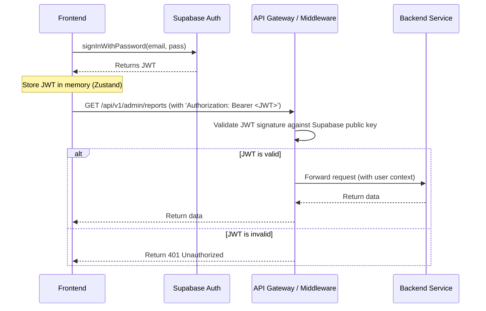
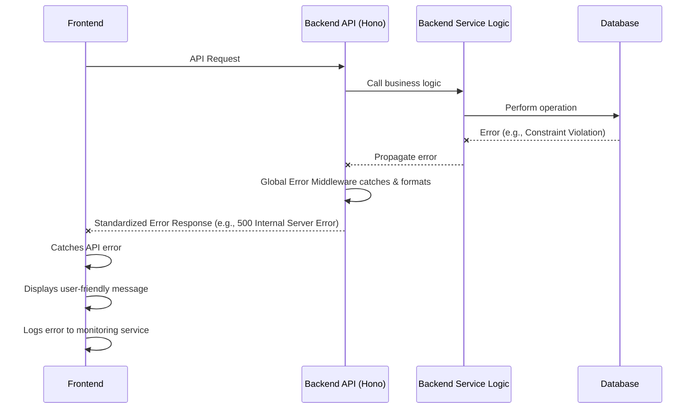

# AI-Powered Civic Voice Assistant Fullstack Architecture Document

## 1. Introduction

This document outlines the complete fullstack architecture for the AI-Powered Civic Voice Assistant, including backend systems, frontend implementation, and their integration. It serves as the single source of truth for AI-driven development, ensuring consistency across the entire technology stack.

This unified approach combines what would traditionally be separate backend and frontend architecture documents, streamlining the development process for modern fullstack applications where these concerns are increasingly intertwined.

### 1.1. Starter Template or Existing Project

N/A - This is a greenfield project.

While no specific starter template was mandated in the PRD, the architecture will be designed with modern full-stack frameworks in mind. Based on the requirements (monorepo, React-based frontend, Node.js backend), a starter like the **T3 Stack (create-t3-turbo)** or a custom **Turborepo** setup would be highly appropriate. For this document, we will proceed with designing the architecture from first principles, but the final implementation could be accelerated by using one of these templates.

### 1.2. Change Log

| Date       | Version | Description                                   | Author              |
| :--------- | :------ | :-------------------------------------------- | :------------------ |
| 2025-10-17 | 1.0     | Initial draft of the full-stack architecture. | Winston (Architect) |

## 2. High Level Architecture

### 2.1. Technical Summary

The proposed architecture is a cloud-native, microservices-based system deployed within a monorepo. The frontend will be a native mobile application for iOS and Android, likely built with React Native, communicating with a backend via an API Gateway. The backend will consist of distinct services (e.g., `reporting-service`, `agent-service`, `admin-service`) running as serverless functions. Data will be segregated into a PostgreSQL database for transactional report data and a NoSQL database (like Redis or MongoDB) for fast-retrieval of live civic information. This design directly supports the PRD's goals by ensuring scalability, separation of concerns, and efficient, real-time data handling for the two distinct user-facing features.

### 2.2. Platform and Infrastructure Choice

**Recommendation:** Vercel + Supabase

- **Option 1: Vercel + Supabase:**
  - **Pros:** Excellent developer experience, seamless integration with Next.js/React Native, built-in serverless functions, managed PostgreSQL (Supabase), and integrated authentication. Ideal for rapid development and iteration.
  - **Cons:** Can be more costly at extreme scale compared to raw AWS.
- **Option 2: AWS Full Stack (Lambda, API Gateway, S3, Cognito, RDS):**
  - **Pros:** Infinitely scalable, highly configurable, and powerful. The enterprise standard for cloud infrastructure.
  - **Cons:** Significantly higher configuration complexity and a steeper learning curve. Slower initial development velocity.

**Rationale:** For this project, speed of development and a streamlined developer experience are critical. The Vercel/Supabase stack provides the best balance of power and simplicity, directly offering the core components required (Serverless Functions, PostgreSQL, Auth) with minimal configuration overhead.

**Platform:** Vercel (for hosting frontend and serverless functions) and Supabase (for PostgreSQL database, storage, and auth).
**Key Services:** Vercel Serverless Functions, Supabase PostgreSQL, Supabase Auth, Supabase Storage.
**Deployment Host and Regions:** Vercel (Global CDN), Supabase (To be selected based on primary user location, e.g., us-east-1).

### 2.3. Repository Structure

**Structure:** Monorepo
**Monorepo Tool:** Turborepo
**Package Organization:**

- `apps/mobile`: The React Native mobile application.
- `apps/admin-web`: The web-based admin dashboard.
- `packages/api`: The shared API gateway and routing layer.
- `packages/services/reporting`: The reporting microservice.
- `packages/services/agent`: The agent microservice.
- `packages/shared-types`: Shared TypeScript types and interfaces.
- `packages/ui`: Shared UI components between mobile and web apps.

### 2.4. High Level Architecture Diagram



### 2.5. Architectural Patterns

- **Microservices:** Backend logic is split into independent services (`reporting`, `agent`, `admin`) to ensure separation of concerns and independent scalability. _Rationale:_ This aligns with the PRD's technical assumption and is essential for managing the distinct logic for issue reporting and the information agent.
- **API Gateway:** A single entry point (`/api`) that routes requests to the appropriate microservice. _Rationale:_ Simplifies the client-side code, centralizes authentication, and provides a single place for rate limiting and monitoring.
- **Monorepo:** All code (frontend, backend, shared packages) is stored in a single repository. _Rationale:_ Facilitates code sharing (especially types), simplifies dependency management, and streamlines cross-stack refactoring.
- **Repository Pattern:** Data access logic will be abstracted away from the business logic within each service. _Rationale:_ This enables easier testing and allows for future database migration flexibility.
- **Serverless Functions:** Backend services will be deployed as stateless, event-driven functions. _Rationale:_ This approach is cost-effective (pay-per-use), automatically scalable, and reduces infrastructure management overhead, aligning with the goal of using open-source and cost-effective solutions.

## 3. Tech Stack

This section outlines the specific technologies, frameworks, and services that will be used to build the AI-Powered Civic Voice Assistant. These choices are based on the architectural decisions made previously and are optimized for developer productivity, scalability, and cost-effectiveness.

### 3.1. Technology Stack Table

| Category             | Technology         | Version | Purpose                                  | Rationale                                                                           |
| :------------------- | :----------------- | :------ | :--------------------------------------- | :---------------------------------------------------------------------------------- |
| Frontend Language    | TypeScript         | 5.x     | Type safety for mobile app               | Reduces bugs and improves developer experience.                                     |
| Frontend Framework   | React Native       | Latest  | Cross-platform mobile app (iOS/Android)  | Build for both platforms from a single codebase, saving time.                       |
| UI Component Library | React Native Paper | Latest  | Material Design components for UI        | High-quality, accessible components for a consistent look and feel.                 |
| State Management     | Zustand            | 4.x     | Lightweight global state management      | Simple, unopinionated, and avoids boilerplate compared to Redux.                    |
| Backend Language     | TypeScript         | 5.x     | Type safety for backend services         | Consistency with the frontend and robust error checking.                            |
| Backend Framework    | Hono               | 4.x     | Performant API framework for serverless  | Lightweight, extremely fast, and ideal for edge function environments like Vercel.  |
| API Style            | REST API           | N/A     | Client-server communication              | Simple, well-understood, and perfectly suited for the required interactions.        |
| Database             | PostgreSQL         | 15.x    | Primary "Complaints DB"                  | Provided by Supabase; powerful, relational, with PostGIS for geo-data.              |
| Cache / Live DB      | Redis (Upstash)    | N/A     | "Live DB" for agent & caching            | Blazing fast key-value store for real-time data retrieval. Upstash integrates well. |
| File Storage         | Supabase Storage   | N/A     | Storing user-uploaded photos             | Integrated with the BaaS, provides a simple and secure S3-compatible API.           |
| Authentication       | Supabase Auth      | N/A     | User and admin authentication            | Handles JWTs, secure login, and session management out-of-the-box.                  |
| Frontend Testing     | Jest & RNTL        | Latest  | Unit & component testing                 | Standard testing stack for React Native.                                            |
| Backend Testing      | Jest & Supertest   | Latest  | Unit & integration testing for API       | Test business logic and API endpoints effectively.                                  |
| E2E Testing          | Maestro            | Latest  | End-to-end mobile app testing            | Simpler and more reliable than alternatives for E2E flows.                          |
| Build Tool           | Turborepo          | Latest  | Monorepo management                      | Manages dependencies and runs tasks efficiently across the monorepo.                |
| Bundler              | Metro              | Latest  | React Native bundler                     | Default and optimized for React Native development.                                 |
| IaC Tool             | Terraform          | Latest  | Infrastructure as Code (Optional)        | Can be used to codify Supabase/Vercel setup for disaster recovery.                  |
| CI/CD                | GitHub Actions     | N/A     | Continuous Integration/Deployment        | Native to GitHub, excellent for automating tests and deployments.                   |
| Monitoring           | Vercel Analytics   | N/A     | Frontend performance monitoring          | Built-in to the Vercel platform for easy monitoring.                                |
| Logging              | Pino               | 8.x     | Structured logging for backend           | Lightweight, fast, and produces structured logs for easier analysis.                |
| CSS Framework        | N/A                | N/A     | React Native uses its own styling system | Styling will be handled via `StyleSheet` or a CSS-in-JS library.                    |

## 4. Data Models

This section defines the core data entities for the project. These TypeScript interfaces will be placed in the `packages/shared-types` directory to ensure type consistency between the mobile client, the admin dashboard, and all backend microservices.

### 4.1. Report

**Purpose:** Represents a single civic issue submitted by a citizen. This is the core entity for the issue reporting system and will be stored in the PostgreSQL "Complaints DB".

**TypeScript Interface:**

```typescript
export enum ReportStatus {
  SUBMITTED = "Submitted",
  IN_PROGRESS = "In Progress",
  RESOLVED = "Resolved",
  REJECTED = "Rejected",
}

export enum ReportPriority {
  LOW = "Low",
  MEDIUM = "Medium",
  HIGH = "High",
}

export interface Report {
  id: string; // Unique tracking ID (UUID)
  createdAt: string; // ISO 8601 timestamp
  updatedAt: string; // ISO 8601 timestamp
  description: string;
  photoUrl: string;
  location: {
    latitude: number;
    longitude: number;
  };
  status: ReportStatus;
  category: string | null; // e.g., 'Pothole', 'Garbage', set by AI
  priority: ReportPriority | null; // Set by AI
  citizenId: string; // Anonymous identifier for the user who submitted
}
```

**Relationships:**

- A `Report` is submitted by a single (anonymous) citizen.
- Each `Report` can have multiple `ReportUpdate` entries tracking its history (not modeled here for brevity).

### 4.2. AdminUser

**Purpose:** Represents an authenticated administrator with rights to manage the system. This model corresponds to the user object provided by Supabase Auth.

**TypeScript Interface:**

```typescript
export enum UserRole {
  ADMIN = "admin",
  // CITIZEN = 'citizen' // Future role if we add citizen accounts
}

export interface AdminUser {
  id: string; // UUID from Supabase Auth
  email: string;
  role: UserRole;
  lastSignInAt: string; // ISO 8601 timestamp
}
```

**Relationships:**

- An `AdminUser` can view and modify many `Report` entities.
- An `AdminUser` can create and manage many `KnowledgeArticle` entities.

### 4.3. KnowledgeArticle

**Purpose:** Represents a piece of informational content managed by admins and served by the AI agent. This will be stored in the fast, "Live DB" (Redis/NoSQL) for quick retrieval.

**TypeScript Interface:**

```typescript
export interface KnowledgeArticle {
  id: string; // Unique ID (e.g., slug or UUID)
  createdAt: string; // ISO 8601 timestamp
  updatedAt: string; // ISO 8601 timestamp
  title: string;
  content: string;
  tags: string[]; // Searchable keywords, e.g., ['garbage', 'schedule']
  authorId: string; // ID of the admin who created/edited it
}
```

**Relationships:**

- Created and maintained by an `AdminUser`.
- Queried by the `agent-service` to answer user questions.

## 5. API Specification

This section defines the REST API that will serve as the interface between the clients (mobile app, admin dashboard) and the backend microservices. We will use the OpenAPI 3.0 standard to ensure a clear, language-agnostic contract. The API will be divided into three main sections: public-facing endpoints for citizens, agent endpoints for queries, and protected admin endpoints.

### 5.1. REST API Specification (OpenAPI 3.0)

Here is a condensed version of the OpenAPI specification, highlighting the most critical endpoints. The full `openapi.yaml` file will be generated and maintained in the repository.

```yaml
openapi: 3.0.3
info:
  title: AI-Powered Civic Voice Assistant API
  version: 1.0.0
  description: API for submitting civic reports and querying the information agent.

servers:
  - url: /api/v1
    description: API Gateway

paths:
  /reports:
    post:
      summary: Submit a new civic issue report
      tags: [Reports]
      requestBody:
        required: true
        content:
          application/json:
            schema:
              type: object
              properties:
                description: { type: string }
                photoUrl: { type: string, format: uri }
                location: { $ref: "#/components/schemas/Location" }
                citizenId: { type: string, format: uuid }
      responses:
        "201":
          description: Report successfully submitted
          content:
            application/json:
              schema:
                type: object
                properties:
                  trackingId: { type: string, format: uuid }

  /reports/{id}:
    get:
      summary: Get the status of a specific report
      tags: [Reports]
      parameters:
        - name: id
          in: path
          required: true
          schema: { type: string, format: uuid }
      responses:
        "200":
          description: Report status
          content:
            application/json:
              schema:
                type: object
                properties:
                  id: { type: string, format: uuid }
                  status: { $ref: "#/components/schemas/ReportStatus" }
                  updatedAt: { type: string, format: date-time }

  /agent/query:
    post:
      summary: Ask a question to the Civic Information Agent
      tags: [Agent]
      requestBody:
        required: true
        content:
          application/json:
            schema:
              type: object
              properties:
                query: { type: string }
      responses:
        "200":
          description: Agent's response
          content:
            application/json:
              schema:
                type: object
                properties:
                  response: { type: string }

  /admin/reports:
    get:
      summary: Get a list of all reports (Admin only)
      tags: [Admin]
      security:
        - bearerAuth: []
      responses:
        "200":
          description: A list of reports
          content:
            application/json:
              schema:
                type: array
                items:
                  $ref: "#/components/schemas/Report"

components:
  securitySchemes:
    bearerAuth:
      type: http
      scheme: bearer
      bearerFormat: JWT

  schemas:
    Report:
      $ref: "../packages/shared-types/schemas/Report.json" # Placeholder for real path
    Location:
      type: object
      properties:
        latitude: { type: number }
        longitude: { type: number }
    ReportStatus:
      type: string
      enum: [Submitted, In Progress, Resolved, Rejected]
```

## 6. Components

This section identifies the major logical components of the full-stack application. Each component has a well-defined boundary and responsibility, which is crucial for a microservices-based architecture. This separation allows teams to work on different parts of the system independently.

### 6.1. Component List

#### Mobile App

- **Responsibility:** The primary user-facing application for iOS and Android. It handles the UI for submitting reports and interacting with the AI agent.
- **Key Interfaces:** UI Screens, API Client (for backend communication).
- **Dependencies:** API Gateway, `shared-types` package.
- **Technology Stack:** React Native, TypeScript, Zustand, React Native Paper.

#### Admin Web App

- **Responsibility:** A secure web dashboard for city authorities to log in, view/manage reports, and update the agent's knowledge base.
- **Key Interfaces:** UI Screens, API Client (for backend communication).
- **Dependencies:** API Gateway, `shared-types` package.
- **Technology Stack:** Next.js, React, TypeScript.

#### API Gateway

- **Responsibility:** Acts as the single front door for all incoming API requests. It authenticates requests, routes them to the appropriate backend service, and aggregates responses.
- **Key Interfaces:** The public REST API specification.
- **Dependencies:** All backend services (Reporting, Agent, Admin), Supabase Auth.
- **Technology Stack:** Hono on Vercel Serverless Functions.

#### Reporting Service

- **Responsibility:** Manages all business logic for issue reports. This includes creating new reports, updating their status, and triggering the AI analysis for categorization.
- **Key Interfaces:** An internal API consumed by the API Gateway.
- **Dependencies:** Complaints DB (PostgreSQL), AI Analysis Service (external or internal).
- **Technology Stack:** Node.js/TypeScript, Hono, PostgreSQL client.

#### Agent Service

- **Responsibility:** Powers the AI assistant. It processes natural language queries from users, fetches data from the Live DB (Redis), and integrates with external services like the Traffic API and NLP service.
- **Key Interfaces:** An internal API consumed by the API Gateway.
- **Dependencies:** Live DB (Redis), External Traffic API, NLP Service.
- **Technology Stack:** Node.js/TypeScript, Hono, Redis client.

#### Admin Service

- **Responsibility:** Contains the business logic required by the Admin Web App, such as fetching lists of reports and managing the `KnowledgeArticle` content in the Live DB.
- **Key Interfaces:** An internal API consumed by the API Gateway.
- **Dependencies:** Complaints DB (PostgreSQL), Live DB (Redis).
- **Technology Stack:** Node.js/TypeScript, Hono, PostgreSQL client, Redis client.

### 6.2. Component Diagram

This diagram illustrates the high-level relationships between the core components of the system.



## 7. External APIs

This section documents the critical external services the project will integrate with. Properly identifying and understanding these dependencies is crucial for risk management, as we are reliant on these third-party systems for core functionality.

### 7.1. NLP Service (Google Cloud Natural Language)

- **Purpose:** To process natural language queries from users for the AI Agent and to perform sentiment/category analysis on incoming issue reports.
- **Documentation:** `https://cloud.google.com/natural-language/docs`
- **Base URL(s):** `https://language.googleapis.com`
- **Authentication:** API Key or OAuth 2.0 Service Account.
- **Rate Limits:** Standard Google Cloud quotas apply. Must be reviewed during implementation to ensure they align with expected user load.
- **Integration Notes:** This service is fundamental for both the agent's ability to understand questions and the backend's ability to auto-triage reports. The specific methods used will be `analyzeEntities`, `analyzeSyntax`, and potentially `classifyText`.

### 7.2. Traffic API (Google Maps Routes API)

- **Purpose:** To provide real-time traffic data, enabling the AI Agent to answer user questions about road conditions and travel times.
- **Documentation:** `https://developers.google.com/maps/documentation/routes`
- **Base URL(s):** `https://routes.googleapis.com`
- **Authentication:** API Key.
- **Rate Limits:** This is a critical consideration. The free tier is limited, and costs can scale with usage. Caching strategies will be essential to manage costs and stay within limits.
- **Integration Notes:** The `computeRoutes` method will be the primary endpoint used. The response provides real-time traffic conditions, which will be parsed and formatted by the `Agent Service` before being sent to the user. This is identified as a key technical and financial risk in the PRD.

## 8. Core Workflows

This section provides sequence diagrams to illustrate the step-by-step interactions between components for the system's most critical user journeys. These diagrams are essential for understanding how data flows through the system to fulfill a user's request.

### 8.1. Workflow 1: New Issue Submission

This diagram shows the flow of a citizen submitting a new issue report, from the mobile app to the database, including the asynchronous AI-powered analysis.



### 8.2. Workflow 2: Agent Traffic Query

This diagram illustrates how the AI agent processes a user's question about traffic, involving the NLP service and the external traffic data provider.



## 9. Database Schema

This section translates our conceptual data models into physical database schemas for both the relational "Complaints DB" (PostgreSQL) and the "Live DB" (Redis).

### 9.1. Complaints DB (PostgreSQL)

This schema will be implemented in the Supabase PostgreSQL database. It is designed to be robust, scalable, and to support geospatial queries. We will use the `postgis` extension for location data.

```sql
-- Enable PostGIS for geospatial functions
CREATE EXTENSION IF NOT EXISTS postgis;

-- Define custom enum types for status and priority to ensure data integrity
CREATE TYPE report_status AS ENUM ('Submitted', 'In Progress', 'Resolved', 'Rejected');
CREATE TYPE report_priority AS ENUM ('Low', 'Medium', 'High');

-- The main table for storing all civic issue reports
CREATE TABLE reports (
    -- Use UUID for a non-guessable, unique primary key
    id UUID PRIMARY KEY DEFAULT gen_random_uuid(),

    -- Timestamps for tracking and auditing
    created_at TIMESTAMPTZ NOT NULL DEFAULT NOW(),
    updated_at TIMESTAMPTZ NOT NULL DEFAULT NOW(),

    -- Core report data
    description TEXT NOT NULL,
    photo_url VARCHAR(2048) NOT NULL, -- URL to the image in Supabase Storage

    -- Use a GEOGRAPHY type for accurate location storage and queries
    location GEOGRAPHY(POINT, 4326) NOT NULL,

    -- AI-classified data
    status report_status NOT NULL DEFAULT 'Submitted',
    category VARCHAR(255),
    priority report_priority,

    -- Identifier for the citizen who submitted the report
    citizen_id UUID NOT NULL
);

-- Create indexes to speed up common queries from the admin dashboard
CREATE INDEX idx_reports_status ON reports(status);
CREATE INDEX idx_reports_priority ON reports(priority);
CREATE INDEX idx_reports_citizen_id ON reports(citizen_id);

-- Create a geospatial index for location-based queries
CREATE INDEX idx_reports_location ON reports USING GIST (location);

-- Function to automatically update the 'updated_at' timestamp on any change
CREATE OR REPLACE FUNCTION trigger_set_timestamp()
RETURNS TRIGGER AS $$
BEGIN
  NEW.updated_at = NOW();
  RETURN NEW;
END;
$$ LANGUAGE plpgsql;

CREATE TRIGGER set_timestamp
BEFORE UPDATE ON reports
FOR EACH ROW
EXECUTE PROCEDURE trigger_set_timestamp();

```

### 9.2. Live DB (Redis)

For Redis, the "schema" is defined by the key structure and the data types we use. We will store JSON objects for our `KnowledgeArticle` entities and use Redis Sets to index them by tags for fast lookups.

**Key Structure for Knowledge Articles:**

- **Article Data:** A HASH or JSON object to store the article itself.
  - `Key`: `kb:article:<article_id>`
  - `Value`: `{ "title": "...", "content": "...", "tags": ["garbage", "schedule"] }`
- **Tag Index:** A Redis SET for each tag, containing the IDs of articles with that tag.
  - `Key`: `kb:tag:garbage`
  - `Value (Set)`: `[<article_id_1>, <article_id_2>]`
  - `Key`: `kb:tag:schedule`
  - `Value (Set)`: `[<article_id_1>, <article_id_3>]`

_Query Pattern:_ To find articles about "garbage schedule", we would compute the intersection of the `kb:tag:garbage` and `kb:tag:schedule` sets.

**Key Structure for Caching Traffic Data:**

- **Cached Data:** A simple key-value pair with a Time-To-Live (TTL).
  - `Key`: `cache:traffic:<location_hash>` (e.g., `cache:traffic:40.7128,-74.0060`)
  - `Value`: The JSON response from the Google Maps API.
  - `TTL`: 60 seconds (to ensure data remains fresh).

## 10. Frontend Architecture

This section details the internal architecture of the React Native mobile application. The goal is to create a codebase that is maintainable, scalable, and easy for developers to work in.

### 10.1. Component Architecture

#### Component Organization

We will follow a hybrid approach, combining atomic design principles with feature-based organization.

```
/src/components/
├── ui/               # Reusable, universal UI elements (e.g., Button, Input, Card)
│   ├── Button.tsx
│   └── Card.tsx
├── domain/           # Components tied to specific data models (e.g., ReportList, ReportCard)
│   ├── ReportCard.tsx
│   └── ReportList.tsx
└── layout/           # Screen layout and structure (e.g., ScreenWrapper, Header)
    └── ScreenWrapper.tsx

/src/features/        # Feature-specific screens and their components
├── report-submission/
│   ├── components/
│   └── ReportSubmissionScreen.tsx
└── agent-chat/
    ├── components/
    └── AgentChatScreen.tsx
```

#### Component Template

All components will be typed functional components using TypeScript.

```typescript
import React from "react";
import { View, Text, StyleSheet } from "react-native";

interface MyComponentProps {
  title: string;
}

const MyComponent: React.FC<MyComponentProps> = ({ title }) => {
  return (
    <View style={styles.container}>
      <Text>{title}</Text>
    </View>
  );
};

const styles = StyleSheet.create({
  container: {
    // Component styles
  },
});

export default MyComponent;
```

### 10.2. State Management Architecture

We will use Zustand for its simplicity and minimal boilerplate. State will be organized into logical stores.

#### State Structure (Zustand)

```typescript
import { create } from "zustand";

interface AuthState {
  user: AdminUser | null;
  token: string | null;
  isAuthenticated: boolean;
  setUser: (user: AdminUser, token: string) => void;
  clearAuth: () => void;
}

export const useAuthStore = create<AuthState>((set) => ({
  user: null,
  token: null,
  isAuthenticated: false,
  setUser: (user, token) => set({ user, token, isAuthenticated: true }),
  clearAuth: () => set({ user: null, token: null, isAuthenticated: false }),
}));
```

#### State Management Patterns

- **Separate Stores:** Create different stores for different domains (e.g., `useAuthStore`, `useReportStore`, `useAgentStore`).
- **Selectors:** Use selectors to subscribe components only to the state slices they need, preventing unnecessary re-renders.
- **Async Actions:** Async operations (like API calls) will be handled in service files and their results will be set in the store.

### 10.3. Routing Architecture

We will use `React Navigation` as the standard for routing in the React Native app.

#### Route Organization

```
/src/navigation/
├── AppNavigator.tsx      # Main navigator, decides between Auth and Main stacks
├── AuthStack.tsx         # Login, Register screens
└── MainStack.tsx         # The main app experience (Tabs, Modals, etc.)
```

#### Protected Route Pattern

The main `AppNavigator` will act as a gatekeeper, showing the `AuthStack` if the user is not authenticated, and the `MainStack` if they are.

```typescript
// AppNavigator.tsx
import React from "react";
import { NavigationContainer } from "@react-navigation/native";
import { useAuthStore } from "../stores/useAuthStore";
import AuthStack from "./AuthStack";
import MainStack from "./MainStack";

const AppNavigator = () => {
  const isAuthenticated = useAuthStore((state) => state.isAuthenticated);

  return (
    <NavigationContainer>
      {isAuthenticated ? <MainStack /> : <AuthStack />}
    </NavigationContainer>
  );
};

export default AppNavigator;
```

### 10.4. Frontend Services Layer

This layer will abstract all API communication, providing a clean interface to the rest of the application.

#### API Client Setup

We will use `axios` to create a centralized API client instance.

```typescript
// /src/services/apiClient.ts
import axios from "axios";
import { useAuthStore } from "../stores/useAuthStore";

const apiClient = axios.create({
  baseURL: "/api/v1", // This will be the production URL
  headers: {
    "Content-Type": "application/json",
  },
});

// Use an interceptor to automatically add the auth token to every request
apiClient.interceptors.request.use((config) => {
  const token = useAuthStore.getState().token;
  if (token) {
    config.headers.Authorization = `Bearer ${token}`;
  }
  return config;
});

export default apiClient;
```

#### Service Example

```typescript
// /src/services/reportService.ts
import apiClient from "./apiClient";
import { Report } from "../types"; // Assuming shared types

interface SubmitReportPayload {
  description: string;
  photoUrl: string;
  location: { latitude: number; longitude: number };
}

export const reportService = {
  submitReport: async (
    payload: SubmitReportPayload
  ): Promise<{ trackingId: string }> => {
    const response = await apiClient.post("/reports", payload);
    return response.data;
  },
};
```

## 11. Backend Architecture

This section describes the design of the serverless backend. The architecture is built around Vercel Serverless Functions, a PostgreSQL database managed by Supabase, and a Redis instance for caching and the Live DB. The design prioritizes scalability, low maintenance, and performance.

### 11.1. Service Architecture (Serverless)

Our backend will be composed of serverless functions automatically deployed by Vercel from the `/apps/api` directory in our monorepo. The "microservices" we defined earlier (`Reporting Service`, `Agent Service`) are logical separations of business logic that will live in the `/packages/services/*` directories and will be called by these public-facing API functions.

#### Function Organization (Vercel API Routes)

Vercel uses a file-based routing system. The structure within `/apps/api` will define our public API endpoints.

```
/apps/api/
└── v1/
    ├── reports/
    │   ├── index.ts        # Handles POST /api/v1/reports
    │   └── [id].ts         # Handles GET /api/v1/reports/{id}
    ├── agent/
    │   └── query.ts        # Handles POST /api/v1/agent/query
    └── admin/
        ├── reports.ts      # Handles GET /api/v1/admin/reports
        └── knowledge.ts    # Handles POST, PATCH /api/v1/admin/knowledge
```

#### Function Template (Hono on Vercel)

We will use the lightweight Hono framework to define the logic within each function file.

```typescript
// /apps/api/v1/reports/index.ts
import { Hono } from "hono";
import { handle } from "hono/vercel";
import { reportingLogic } from "@packages/services/reporting"; // Import business logic

export const config = {
  runtime: "edge", // Use the fast Vercel Edge runtime
};

const app = new Hono().basePath("/api/v1");

app.post("/reports", async (c) => {
  const body = await c.req.json();
  const result = await reportingLogic.submitReport(body); // Delegate to service logic
  return c.json({ trackingId: result.id }, 201);
});

export default handle(app);
```

### 11.2. Database Architecture

#### Schema Design

The detailed SQL schema for the "Complaints DB" (PostgreSQL) and the key structure for the "Live DB" (Redis) are defined in **Section 9: Database Schema**. This remains the single source of truth for our data layer design.

#### Data Access Layer (Repository Pattern)

To decouple our business logic from the database, we will use the repository pattern. Each service will have a repository responsible for all its database interactions.

```typescript
// /packages/services/reporting/repository.ts
import { createClient } from "@supabase/supabase-js";
import { Report } from "@packages/shared-types";

// Initialize Supabase client once
const supabase = createClient(
  process.env.SUPABASE_URL!,
  process.env.SUPABASE_ANON_KEY!
);

export const reportRepository = {
  async create(reportData: Omit<Report, "id">): Promise<Report> {
    const { data, error } = await supabase
      .from("reports")
      .insert([reportData])
      .select()
      .single();

    if (error) throw new Error(error.message);
    return data;
  },

  async findById(id: string): Promise<Report | null> {
    // ... implementation
  },
};
```

### 11.3. Authentication and Authorization

Authentication will be handled entirely by Supabase Auth, which uses a JWT-based system. Our backend's responsibility is simply to validate the JWT on protected routes.

#### Auth Flow (JWT Validation)



#### Middleware for Authorization (Hono)

A simple middleware in Hono will handle the JWT validation for all protected routes.

```typescript
// /apps/api/v1/admin/_middleware.ts
import { createMiddleware } from "hono/factory";
import { verify } from "hono/jwt"; // Using Hono's built-in JWT middleware

export const authMiddleware = createMiddleware(async (c, next) => {
  const authHeader = c.req.header("Authorization");
  if (!authHeader || !authHeader.startsWith("Bearer ")) {
    return c.json({ error: "Unauthorized" }, 401);
  }
  const token = authHeader.substring(7);

  try {
    // The secret would be the Supabase JWT secret
    await verify(token, process.env.SUPABASE_JWT_SECRET!);
    await next();
  } catch (err) {
    return c.json({ error: "Invalid token" }, 401);
  }
});
```

## 12. Unified Project Structure

This section outlines the complete directory structure for the monorepo. This structure is designed using Turborepo to manage the frontend applications, the backend API, and all the shared code in a clean and scalable way.

```plaintext
civic-voice-assistant/
├── .github/                    # CI/CD workflows
│   └── workflows/
│       └── ci.yaml
├── apps/                       # Deployable applications
│   ├── mobile/                 # React Native mobile app for citizens
│   │   ├── src/
│   │   │   ├── components/
│   │   │   ├── features/       # Screens and feature-specific logic
│   │   │   ├── navigation/
│   │   │   ├── services/
│   │   │   └── stores/
│   │   └── package.json
│   ├── admin-web/              # Next.js admin dashboard
│   │   ├── src/
│   │   │   ├── app/            # Next.js 13+ app router
│   │   │   └── components/
│   │   └── package.json
│   └── api/                    # Hono backend API on Vercel
│       └── v1/
│           ├── reports/
│           │   ├── index.ts
│           │   └── [id].ts
│           ├── agent/
│           │   └── query.ts
│           └── admin/
│               └── _middleware.ts
├── packages/                   # Shared local packages
│   ├── shared-types/           # Shared TypeScript types (Report, User, etc.)
│   │   └── src/
│   ├── ui/                     # Shared React components (e.g., for admin-web)
│   │   └── src/
│   ├── config/                 # Shared configurations
│   │   ├── eslint/
│   │   └── typescript/
│   ├── services/               # Shared backend business logic (The "Microservices")
│   │   ├── reporting/          # Reporting service logic & repository
│   │   └── agent/              # Agent service logic & repository
│   └── hooks/                  # Shared React hooks (e.g., useAuth)
├── infrastructure/             # Infrastructure as Code (IaC)
│   └── terraform/              # Optional Terraform scripts for Supabase
├── docs/                       # Project documentation
│   ├── prd.md
│   └── architecture.md
├── .env.example                # Template for environment variables
├── turbo.json                  # Turborepo configuration
└── README.md
```

## 13. Development Workflow

This section outlines the standardized process for setting up and running the project locally. A smooth and consistent development workflow is essential for developer productivity.

### 13.1. Local Development Setup

#### Prerequisites

Before starting, ensure you have the following installed:

```bash
# Node.js (v18 or later)
# uv (for package management)
# Docker (for running local database instances if not using cloud-based dev environments)
# Turborepo CLI (globally installed: uv add -g turbo)
```

#### Initial Setup

To set up the project for the first time:

```bash
# 1. Clone the repository
git clone <repository_url>
cd civic-voice-assistant

# 2. Install all dependencies using uv
uv install

# 3. Set up your local environment variables
cp .env.example .env
# ... then fill in the .env file with your local secrets
```

#### Development Commands

We will leverage Turborepo to manage our development scripts.

```bash
# Start all applications (mobile, admin-web, api) in parallel
uv turbo dev

# Start only the mobile application
uv turbo dev --filter=mobile

# Start only the admin web dashboard
uv turbo dev --filter=admin-web

# Run all tests across the entire monorepo
uv turbo test

# Run linting across the entire monorepo
uv turbo lint
```

### 13.2. Environment Configuration

The `.env` file at the root of the project will contain all necessary environment variables.

#### Required Environment Variables

```bash
# .env

# Frontend (React Native & Next.js - must be prefixed)
# These are public and will be exposed to the client
NEXT_PUBLIC_SUPABASE_URL=https://<your-project-ref>.supabase.co
NEXT_PUBLIC_SUPABASE_ANON_KEY=<your-public-anon-key>

# Backend (Server-side only)
# These are secret and must not be exposed to the client
SUPABASE_SERVICE_ROLE_KEY=<your-supabase-service-role-key>
SUPABASE_JWT_SECRET=<your-supabase-jwt-secret>
REDIS_URL=redis://...
GOOGLE_MAPS_API_KEY=<your-google-maps-api-key>
GOOGLE_NLP_API_KEY=<your-google-nlp-api-key>

# No shared variables are expected, as frontend and backend variables
# should be kept separate for security.
```

## 14. Deployment Architecture

This section defines the strategy for deploying the applications and services to our chosen platforms, Vercel and Supabase. The goal is a fully automated, continuous deployment pipeline.

### 14.1. Deployment Strategy

Our deployment strategy is unified around Vercel, which will handle the hosting for our frontend applications and our backend serverless functions.

**Frontend Deployment (`admin-web`):**

- **Platform:** Vercel
- **Build Command:** `uv turbo build --filter=admin-web`
- **Output Directory:** Auto-detected by Vercel for Next.js (`.next`)
- **CDN/Edge:** Vercel Global Edge Network

**Backend Deployment (`api`):**

- **Platform:** Vercel
- **Build Command:** `uv turbo build --filter=api`
- **Deployment Method:** Vercel automatically detects the `/apps/api` directory and deploys each file as an individual Serverless Function, accessible via the same domain as the frontend.

_(Note: The React Native `mobile` app is not "deployed" in the same way. It is built into a binary and submitted to the Apple App Store and Google Play Store. The CI/CD pipeline can be extended to automate this build and submission process.)_

### 14.2. CI/CD Pipeline (GitHub Actions)

We will use GitHub Actions to automate our testing and deployment pipeline. The following workflow will be triggered on pushes and pull requests to the main branches.

```yaml
# .github/workflows/ci.yaml
name: CI/CD Pipeline

on:
  push:
    branches: [main, develop]
  pull_request:
    branches: [main, develop]

jobs:
  test_and_build:
    runs-on: ubuntu-latest
    steps:
      - name: Checkout code
        uses: actions/checkout@v3

      - name: Setup uv
        uses: uv/action-setup@v2
        with:
          version: 8

      - name: Setup Node.js
        uses: actions/setup-node@v3
        with:
          node-version: 18
          cache: "uv"

      - name: Install dependencies
        run: uv install

      - name: Run linting
        run: uv turbo lint

      - name: Run tests
        run: uv turbo test

      - name: Run build
        run: uv turbo build

  deploy_staging:
    needs: test_and_build
    if: github.ref == 'refs/heads/develop'
    runs-on: ubuntu-latest
    steps:
      # ... steps to install Vercel CLI and deploy to staging
      - name: Deploy to Vercel (Staging)
        run: vercel deploy --token=${{ secrets.VERCEL_TOKEN }}

  deploy_production:
    needs: test_and_build
    if: github.ref == 'refs/heads/main'
    runs-on: ubuntu-latest
    steps:
      # ... steps to install Vercel CLI and deploy to production
      - name: Deploy to Vercel --prod --token=${{ secrets.VERCEL_TOKEN }}
```

### 14.3. Environments

We will maintain three distinct environments, each with its own Supabase project to ensure data isolation.

| Environment     | Frontend URL             | Backend URL        | Purpose                                                                                    |
| :-------------- | :----------------------- | :----------------- | :----------------------------------------------------------------------------------------- |
| **Development** | `localhost:3000`         | `localhost:3001`   | Local development by engineers. Connects to a local or dev Supabase project.               |
| **Staging**     | `staging.app-domain.com` | (Same as Frontend) | Pre-production testing (QA). Mirrors production. Connects to the Staging Supabase project. |
| **Production**  | `app.app-domain.com`     | (Same as Frontend) | Live environment for end-users. Connects to the Production Supabase project.               |

## 15. Security and Performance

This section outlines the strategies for ensuring the application is secure, performant, and reliable. These are not afterthoughts but core architectural considerations.

### 15.1. Security Requirements

**Frontend Security:**

- **CSP Headers:** A strict Content Security Policy (CSP) will be configured in `vercel.json` to prevent cross-site scripting (XSS) and data injection attacks.
- **XSS Prevention:** React and React Native inherently mitigate XSS by escaping content rendered in JSX. We will rely on this and avoid dangerous practices like `dangerouslySetInnerHTML`.
- **Secure Storage:** On the mobile app, sensitive items like refresh tokens will be stored in the device's secure enclave using `react-native-keychain`. For the web admin app, Supabase's auth client will use `httpOnly` cookies.

**Backend Security:**

- **Input Validation:** All incoming API request bodies and parameters will be strictly validated using `Zod` against our shared TypeScript types. Any invalid request will be rejected with a 400 error.
- **Rate Limiting:** Vercel's edge network will be configured to enforce rate limiting on all API endpoints to prevent abuse and denial-of-service attacks.
- **CORS Policy:** The Cross-Origin Resource Sharing (CORS) policy will be configured on Vercel to only allow requests from our specific application domains.

**Authentication Security:**

- **Token Storage:** JWTs will be managed by the Supabase client libraries, which follow best practices for secure storage (as described above).
- **Session Management:** We will use stateless JWTs with short-lived access tokens and long-lived refresh tokens, which is a secure and scalable pattern handled automatically by Supabase.
- **Password Policy:** We will enforce strong password policies (minimum length, complexity) within the Supabase Auth settings.

### 15.2. Performance Optimization

**Frontend Performance:**

- **Bundle Size Target:** We will use tools like `react-native-bundle-visualizer` and Next.js's build analyzer to monitor and minimize bundle sizes.
- **Loading Strategy:** We will aggressively use code splitting and lazy loading (`React.lazy`) for screens and components. For long lists, we will use virtualized lists (`FlatList`, `react-window`) to render only visible items.
- **Caching Strategy:** We will use a client-side data-caching library like `React Query` (TanStack Query) to cache API responses, reducing redundant network requests and providing a faster, more optimistic UI.

**Backend Performance:**

- **Response Time Target:** Our goal is a p95 response time of < 200ms for all common API endpoints.
- **Database Optimization:** The indexes defined in the PostgreSQL schema are the primary optimization. We will also analyze query performance using `EXPLAIN ANALYZE` for any slow endpoints.
- **Caching Strategy:** The Redis "Live DB" is our primary caching layer for hot data like traffic information. We can also implement a cache-aside strategy for read-heavy endpoints in the `reporting-service` if needed.

## 16. Testing Strategy

This section outlines our comprehensive, multi-layered testing strategy. The goal is to ensure application quality, prevent regressions, and enable developers to ship features with confidence. We will follow the principles of the testing pyramid.

### 16.1. Testing Pyramid

```
      /------------------\
     /   E2E Tests      \   (Maestro)
    /  (User Journeys)   \
   /----------------------\
  /  Integration Tests   \  (RNTL, Supertest)
 / (Component & API)      \
/--------------------------\
/      Unit Tests          \ (Jest)
/(Functions & Logic)        \
----------------------------
```

### 16.2. Test Organization

Tests will be co-located with the code they are testing to make them easy to find and run.

#### Frontend Tests (`apps/mobile`, `apps/admin-web`)

```
/src/
├── components/
│   └── ui/
│       ├── Button.tsx
│       └── Button.test.tsx  # Component unit test
└── features/
    └── report-submission/
        ├── ReportSubmissionScreen.tsx
        └── ReportSubmissionScreen.integration.test.tsx # Component integration test
```

#### Backend Tests (`packages/services`, `apps/api`)

```
/packages/services/reporting/
├── logic.ts
└── logic.test.ts            # Business logic unit test

/apps/api/v1/reports/
├── index.ts
└── index.integration.test.ts # API endpoint integration test
```

#### E2E Tests

End-to-end tests will live in a dedicated top-level directory.

```
/e2e/
├── report-submission.yaml   # Maestro flow for submitting a report
└── agent-query.yaml         # Maestro flow for querying the agent
```

### 16.3. Test Examples

#### Frontend Component Test (React Native Testing Library)

```typescript
// Button.test.tsx
import { render, fireEvent } from "@testing-library/react-native";
import Button from "./Button";

it("calls onPress when pressed", () => {
  const onPressMock = jest.fn();
  const { getByText } = render(<Button title="Submit" onPress={onPressMock} />);

  fireEvent.press(getByText("Submit"));

  expect(onPressMock).toHaveBeenCalledTimes(1);
});
```

#### Backend API Test (Supertest)

```typescript
// index.integration.test.ts
import request from "supertest";
import { app } from "./index"; // Assuming app is exportable for tests

describe("POST /api/v1/reports", () => {
  it("should create a new report and return a trackingId", async () => {
    const response = await request(app.fetch)
      .post("/api/v1/reports")
      .send({ description: "Test", photoUrl: "...", location: "..." });

    expect(response.status).toBe(201);
    expect(response.body).toHaveProperty("trackingId");
  });
});
```

#### E2E Test (Maestro)

```yaml
# report-submission.yaml
appId: com.civicvoice
---
- launchApp
- tapOn: "Report an Issue"
- tapOn: "Description"
- inputText: "There is a large pothole on Main Street."
- tapOn: "Attach Photo"
-  # ... steps to select a photo
- tapOn: "Submit Report"
- assertVisible: "Report Submitted Successfully!"
- assertVisible: "Your tracking ID is: *"
```

## 17. Coding Standards

This section defines a small but non-negotiable set of coding standards. These rules are designed to ensure consistency, prevent common errors, and make the codebase easy for both human and AI developers to navigate and modify. These will be enforced by linting rules where possible.

### 17.1. Critical Fullstack Rules

- **Single Source of Truth for Types:** All shared data structures (e.g., `Report`, `AdminUser`) MUST be defined in the `packages/shared-types` package. Never redefine these types in an application or service.
- **Use the Service Layer:** Frontend applications MUST NOT make direct API calls (e.g., using `fetch` or `axios` in a component). All data fetching and mutation must be done through the dedicated service layer (e.g., `reportService.submitReport`).
- **Isolate Business Logic:** API route handlers in `apps/api` should be lean. They are responsible for request/response handling ONLY. All core business logic MUST be implemented in functions within the `packages/services` directory.
- **Centralized Environment Variables:** Never access environment variables directly via `process.env` within application code. Create a single, validated config object at application startup and import from it.
- **Immutable State:** Never mutate frontend state directly. Always use the actions and setters provided by the Zustand store to ensure predictable state transitions.

### 17.2. Naming Conventions

| Element                 | Convention                    | Example                       |
| :---------------------- | :---------------------------- | :---------------------------- |
| Components (React)      | `PascalCase`                  | `ReportCard.tsx`              |
| Hooks (React)           | `camelCase` with `use` prefix | `useAuth.ts`                  |
| API URL Paths           | `kebab-case`                  | `/api/v1/user-profiles`       |
| Database Tables/Columns | `snake_case`                  | `user_profiles`, `created_at` |
| Functions / Variables   | `camelCase`                   | `getUserProfile()`            |
| TypeScript Interfaces   | `PascalCase`                  | `interface Report { ... }`    |

## 18. Error Handling Strategy

A consistent and robust error handling strategy is crucial for both user experience and system maintainability. This section outlines how errors will be managed, from their origin in the backend to their presentation in the frontend.

### 18.1. Error Flow

This sequence diagram illustrates how an error originating in the backend is processed and communicated back to the user.



### 18.2. Error Response Format

All API errors returned from the backend will adhere to a standardized JSON format. This interface will be defined in `packages/shared-types`.

```typescript
// packages/shared-types/src/errors.ts
export interface ApiErrorResponse {
  error: {
    code: string; // A unique, internal error code (e.g., "DB_ERROR", "VALIDATION_FAILED")
    message: string; // A user-friendly message (e.g., "Invalid input provided.")
    details?: Record<string, any>; // Optional: specific validation errors, stack trace (dev only)
    timestamp: string; // ISO 8601 timestamp of when the error occurred
    requestId?: string; // Optional: Correlation ID for tracing
  };
}
```

### 18.3. Frontend Error Handling

The frontend will implement a centralized error handling mechanism to gracefully manage API errors and other runtime exceptions.

```typescript
// /src/services/apiClient.ts (Axios Interceptor)
import apiClient from "./apiClient";
import { ApiErrorResponse } from "@packages/shared-types";

apiClient.interceptors.response.use(
  (response) => response,
  (error) => {
    if (error.response) {
      const apiError: ApiErrorResponse = error.response.data;
      // Display a user-friendly message (e.g., using a toast notification)
      console.error("API Error:", apiError.error.message);
      // Log the error to a monitoring service
      // Sentry.captureException(error);
    } else if (error.request) {
      // Network error
      console.error("Network Error:", error.message);
    } else {
      // Other errors
      console.error("Client Error:", error.message);
    }
    return Promise.reject(error);
  }
);

// In components, use error boundaries for rendering errors
// And try/catch in service calls
```

### 18.4. Backend Error Handling

The backend will utilize a global error handling middleware to catch exceptions, log them, and return standardized error responses.

```typescript
// /apps/api/v1/_middleware.ts (or a dedicated error handler file)
import { Hono } from "hono";
import { ApiErrorResponse } from "@packages/shared-types";

const app = new Hono();

app.onError((err, c) => {
  console.error(`${err}`); // Log the full error for debugging

  const errorResponse: ApiErrorResponse = {
    error: {
      code: "INTERNAL_SERVER_ERROR",
      message: "An unexpected error occurred.",
      timestamp: new Date().toISOString(),
      // details: process.env.NODE_ENV === 'development' ? err.stack : undefined,
    },
  };

  if (err instanceof SomeCustomValidationError) {
    errorResponse.error.code = "VALIDATION_FAILED";
    errorResponse.error.message = err.message;
    return c.json(errorResponse, 400);
  }

  // Default to 500 Internal Server Error
  return c.json(errorResponse, 500);
});

// ... other middleware and routes
```

## 19. Monitoring and Observability

A robust monitoring strategy is essential for understanding the health, performance, and usage of our application. This section outlines the tools and key metrics we will track to ensure operational excellence.

### 19.1. Monitoring Stack

- **Frontend Monitoring:**
  - **Vercel Analytics:** For web vitals, page views, and general frontend performance metrics for the `admin-web` app.
  - **Sentry:** For real-time error tracking and performance monitoring across both the `mobile` and `admin-web` applications.
- **Backend Monitoring:**
  - **Vercel Analytics:** For serverless function invocations, cold starts, and execution durations of the `api` endpoints.
  - **Supabase Dashboard:** For detailed PostgreSQL database metrics (CPU, memory, connections, query performance) and Redis metrics.
- **Error Tracking:**
  - **Sentry:** A centralized platform for capturing, aggregating, and alerting on all application errors (frontend and backend).
- **Performance Monitoring:**
  - **Vercel Analytics & Sentry:** Will provide initial performance insights. For deeper analysis, custom metrics might be integrated into a dashboard.

### 19.2. Key Metrics

**Frontend Metrics:**

- **Core Web Vitals:** Largest Contentful Paint (LCP), First Input Delay (FID), Cumulative Layout Shift (CLS) for `admin-web`.
- **JavaScript Errors:** Number and rate of unhandled exceptions and console errors (tracked by Sentry).
- **API Response Times:** Latency of API calls as experienced by the client.
- **User Interactions:** Key user flows completion rates, screen views, and button clicks.

**Backend Metrics:**

- **Request Rate:** Number of API requests per second (RPS) for each endpoint.
- **Error Rate:** Percentage of API requests resulting in 5xx errors.
- **Response Time:** Average, p95, and p99 latency for each API endpoint.
- **Cold Starts:** Frequency and duration of serverless function cold starts.
- **Database Query Performance:** Slow query logs, connection pool usage, and overall database resource utilization.
- **External API Call Success/Failure Rates:** Monitoring the reliability of calls to the Google Maps and NLP APIs.

## 20. Checklist Results Report

### Executive Summary

- **Overall architecture readiness:** High. The architecture is well-defined, comprehensive, and directly addresses the PRD requirements. It leverages modern, scalable technologies and best practices.
- **Critical risks identified:** The primary critical risks are the reliance on external APIs (Traffic and NLP) for core functionality, particularly regarding their cost, rate limits, and reliability.
- **Key strengths of the architecture:** Strong modularity with microservices and monorepo, clear separation of concerns, robust security considerations, and a well-defined development and deployment workflow. The use of Supabase and Vercel streamlines development.
- **Project type:** Full-stack (Mobile App, Admin Web App, Backend API). All sections of the checklist were evaluated.

### Section Analysis

| Section                                | Pass Rate | Most Concerning Failures/Gaps                                                                                   | Sections Requiring Immediate Attention                                                                     |
| :------------------------------------- | :-------- | :-------------------------------------------------------------------------------------------------------------- | :--------------------------------------------------------------------------------------------------------- |
| 1. Requirements Alignment              | 80%       | Reliability/Resilience, Compliance                                                                              | Reliability/Resilience, Compliance                                                                         |
| 2. Architecture Fundamentals           | 100%      | None                                                                                                            | None                                                                                                       |
| 3. Technical Stack & Decisions         | 88%       | Data migration/seeding, Data backup/recovery                                                                    | Data migration/seeding, Data backup/recovery                                                               |
| 4. Frontend Design & Implementation    | 88%       | Route definitions table, Deep linking                                                                           | Route definitions table, Deep linking                                                                      |
| 5. Resilience & Operational Readiness  | 70%       | Retry policies, Circuit breakers, Graceful degradation, Alerting thresholds, Resource sizing, Rollback/recovery | Retry policies, Circuit breakers, Graceful degradation, Alerting thresholds, Rollback/recovery             |
| 6. Security & Compliance               | 70%       | Data retention/purging, Backup encryption, Data access audit trails                                             | Data retention/purging, Backup encryption, Data access audit trails                                        |
| 7. Implementation Guidance             | 70%       | Performance testing, Security testing, Visual regression testing, Accessibility testing tools/process/data      | Performance testing, Security testing, Visual regression testing, Accessibility testing tools/process/data |
| 8. Dependency & Integration Management | 80%       | Licensing implications, Update/patching strategy                                                                | Licensing implications, Update/patching strategy                                                           |
| 9. AI Agent Implementation Suitability | 100%      | None                                                                                                            | None                                                                                                       |
| 10. Accessibility Implementation       | 50%       | ARIA guidelines, Accessibility testing tools/process/manual/automated                                           | ARIA guidelines, Accessibility testing tools/process/manual/automated                                      |

### Risk Assessment

1.  **External API Reliance (High):**

    - **Risk:** Over-reliance on Google Maps Routes API and NLP Service for core functionality. Potential for high costs, rate limit issues, and service outages.
    - **Mitigation:** Implement robust caching (Redis for traffic), monitor API usage and costs closely, define clear fallback strategies for API failures (e.g., default responses, degraded functionality).
    - **Timeline Impact:** Requires immediate attention during implementation to design and test fallback mechanisms.

2.  **Operational Readiness Gaps (Medium):**

    - **Risk:** Lack of explicit detail on retry policies, circuit breakers, graceful degradation, alerting thresholds, and rollback procedures could lead to system instability and slow recovery from failures.
    - **Mitigation:** Define and implement these resilience patterns. Establish clear alerting rules and runbooks. Document rollback procedures.
    - **Timeline Impact:** Needs to be addressed during the early stages of development and deployment planning.

3.  **Data Management & Compliance (Medium):**

    - **Risk:** Missing details on data migration, backup/recovery, retention/purging, and audit trails. Potential for data loss, compliance violations, and difficulty in data lifecycle management.
    - **Mitigation:** Document specific strategies for these areas, leveraging Supabase's capabilities. Ensure compliance with NFR7 (privacy/security for Complaints DB).
    - **Timeline Impact:** Critical for data integrity and regulatory compliance; should be addressed before production deployment.

4.  **Comprehensive Testing (Medium):**

    - **Risk:** Gaps in performance, security, visual regression, and accessibility testing. Could lead to performance issues, security vulnerabilities, UI regressions, and accessibility barriers.
    - **Mitigation:** Integrate these testing types into the CI/CD pipeline. Identify specific tools and processes.
    - **Timeline Impact:** Should be addressed during the development phase to ensure quality.

5.  **Frontend Routing & Deep Linking (Low):**
    - **Risk:** Incomplete route definitions and lack of deep linking considerations could lead to navigation issues and poor user experience.
    - **Mitigation:** Create a comprehensive route definition table. Define deep linking strategy.
    - **Timeline Impact:** Can be addressed during frontend development.

### Recommendations

- **Must-fix items before development:**

  - **Reliability & Resilience:** Explicitly define and implement retry policies, circuit breakers, and graceful degradation strategies for critical services.
  - **Data Management:** Document data migration, backup/recovery, retention/purging, and audit trail strategies.
  - **External API Management:** Implement robust caching and fallback mechanisms for the Traffic and NLP APIs.
  - **Compliance:** Explicitly address any specific compliance requirements (e.g., GDPR, HIPAA) if applicable, beyond general security.

- **Should-fix items for better quality:**

  - **Alerting:** Define specific alerting thresholds and strategies for key metrics.
  - **Testing:** Integrate performance, security, visual regression, and accessibility testing into the workflow. Identify specific tools.
  - **Frontend Routing:** Create a comprehensive route definition table and address deep linking.
  - **Dependency Management:** Outline licensing implications and update/patching strategies for external dependencies.

- **Nice-to-have improvements:**
  - Resource sizing recommendations.
  - Detailed rollback and recovery procedures.
  - More explicit documentation on image optimization.

### AI Implementation Readiness

The architecture is highly suitable for AI agent implementation due to its strong modularity, clear interfaces, and explicit coding standards. The breakdown into microservices and well-defined data models makes it easy for an AI to understand and contribute to specific parts of the system. The consistent use of TypeScript and clear naming conventions further enhances AI readability.

### Frontend-Specific Assessment

- **Frontend architecture completeness:** High. The frontend architecture is well-defined, covering component organization, state management, routing, and service layers.
- **Alignment between main and frontend architecture docs:** Excellent. The frontend details are seamlessly integrated into the main architecture document.
- **UI/UX specification coverage:** The PRD provides good UI/UX goals, and the architecture supports these. However, detailed UI/UX specifications (e.g., wireframes, mockups) are outside the scope of this architecture document.
- **Component design clarity:** High. Component organization and templates are clear.
