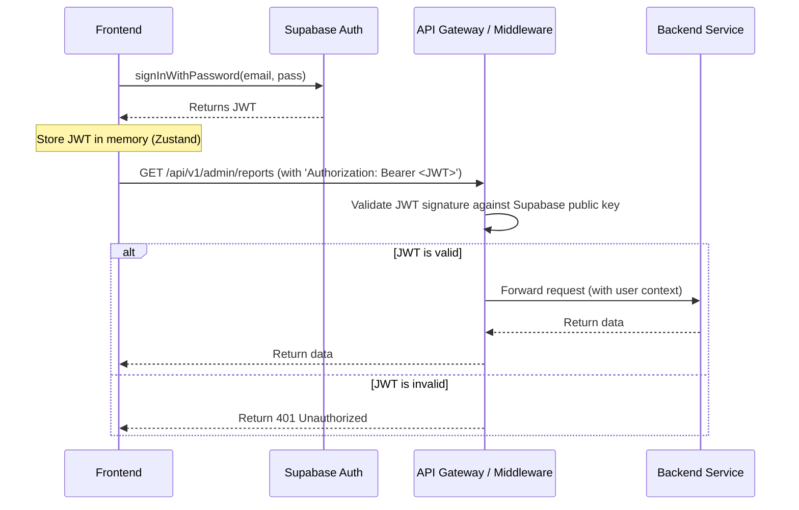

# 11. Backend Architecture

This section describes the design of the serverless backend. The architecture is built around Vercel Serverless Functions, a PostgreSQL database managed by Supabase, and a Redis instance for caching and the Live DB. The design prioritizes scalability, low maintenance, and performance.

## 11.1. Service Architecture (Serverless)

Our backend will be composed of serverless functions automatically deployed by Vercel from the `/apps/api` directory in our monorepo. The "microservices" we defined earlier (`Reporting Service`, `Agent Service`) are logical separations of business logic that will live in the `/packages/services/*` directories and will be called by these public-facing API functions.

### Function Organization (Vercel API Routes)
Vercel uses a file-based routing system. The structure within `/apps/api` will define our public API endpoints.

```
/apps/api/
└── v1/
    ├── reports/
    │   ├── index.ts        # Handles POST /api/v1/reports
    │   └── [id].ts         # Handles GET /api/v1/reports/{id}
    ├── agent/
    │   └── query.ts        # Handles POST /api/v1/agent/query
    └── admin/
        ├── reports.ts      # Handles GET /api/v1/admin/reports
        └── knowledge.ts    # Handles POST, PATCH /api/v1/admin/knowledge
```

### Function Template (Hono on Vercel)
We will use the lightweight Hono framework to define the logic within each function file.

```typescript
// /apps/api/v1/reports/index.ts
import { Hono } from 'hono';
import { handle } from 'hono/vercel';
import { reportingLogic } from '@packages/services/reporting'; // Import business logic

export const config = {
  runtime: 'edge', // Use the fast Vercel Edge runtime
};

const app = new Hono().basePath('/api/v1');

app.post('/reports', async (c) => {
  const body = await c.req.json();
  const result = await reportingLogic.submitReport(body); // Delegate to service logic
  return c.json({ trackingId: result.id }, 201);
});

export default handle(app);
```

## 11.2. Database Architecture

### Schema Design
The detailed SQL schema for the "Complaints DB" (PostgreSQL) and the key structure for the "Live DB" (Redis) are defined in **Section 9: Database Schema**. This remains the single source of truth for our data layer design.

### Data Access Layer (Repository Pattern)
To decouple our business logic from the database, we will use the repository pattern. Each service will have a repository responsible for all its database interactions.

```typescript
// /packages/services/reporting/repository.ts
import { createClient } from '@supabase/supabase-js';
import { Report } from '@packages/shared-types';

// Initialize Supabase client once
const supabase = createClient(process.env.SUPABASE_URL!, process.env.SUPABASE_ANON_KEY!);

export const reportRepository = {
  async create(reportData: Omit<Report, 'id'>): Promise<Report> {
    const { data, error } = await supabase
      .from('reports')
      .insert([reportData])
      .select()
      .single();

    if (error) throw new Error(error.message);
    return data;
  },

  async findById(id: string): Promise<Report | null> {
    // ... implementation
  },
};
```

## 11.3. Authentication and Authorization

Authentication will be handled entirely by Supabase Auth, which uses a JWT-based system. Our backend's responsibility is simply to validate the JWT on protected routes.

### Auth Flow (JWT Validation)



### Middleware for Authorization (Hono)
A simple middleware in Hono will handle the JWT validation for all protected routes.

```typescript
// /apps/api/v1/admin/_middleware.ts
import { createMiddleware } from 'hono/factory';
import { verify } from 'hono/jwt'; // Using Hono's built-in JWT middleware

export const authMiddleware = createMiddleware(async (c, next) => {
  const authHeader = c.req.header('Authorization');
  if (!authHeader || !authHeader.startsWith('Bearer ')) {
    return c.json({ error: 'Unauthorized' }, 401);
  }
  const token = authHeader.substring(7);

  try {
    // The secret would be the Supabase JWT secret
    await verify(token, process.env.SUPABASE_JWT_SECRET!);
    await next();
  } catch (err) {
    return c.json({ error: 'Invalid token' }, 401);
  }
});
```
