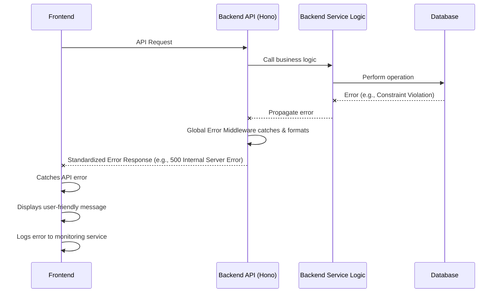

# 18. Error Handling Strategy

A consistent and robust error handling strategy is crucial for both user experience and system maintainability. This section outlines how errors will be managed, from their origin in the backend to their presentation in the frontend.

## 18.1. Error Flow

This sequence diagram illustrates how an error originating in the backend is processed and communicated back to the user.



## 18.2. Error Response Format

All API errors returned from the backend will adhere to a standardized JSON format. This interface will be defined in `packages/shared-types`.

```typescript
// packages/shared-types/src/errors.ts
export interface ApiErrorResponse {
  error: {
    code: string; // A unique, internal error code (e.g., "DB_ERROR", "VALIDATION_FAILED")
    message: string; // A user-friendly message (e.g., "Invalid input provided.")
    details?: Record<string, any>; // Optional: specific validation errors, stack trace (dev only)
    timestamp: string; // ISO 8601 timestamp of when the error occurred
    requestId?: string; // Optional: Correlation ID for tracing
  };
}
```

## 18.3. Frontend Error Handling

The frontend will implement a centralized error handling mechanism to gracefully manage API errors and other runtime exceptions.

```typescript
// /src/services/apiClient.ts (Axios Interceptor)
import apiClient from './apiClient';
import { ApiErrorResponse } from '@packages/shared-types';

apiClient.interceptors.response.use(
  (response) => response,
  (error) => {
    if (error.response) {
      const apiError: ApiErrorResponse = error.response.data;
      // Display a user-friendly message (e.g., using a toast notification)
      console.error('API Error:', apiError.error.message);
      // Log the error to a monitoring service
      // Sentry.captureException(error);
    } else if (error.request) {
      // Network error
      console.error('Network Error:', error.message);
    } else {
      // Other errors
      console.error('Client Error:', error.message);
    }
    return Promise.reject(error);
  }
);

// In components, use error boundaries for rendering errors
// And try/catch in service calls
```

## 18.4. Backend Error Handling

The backend will utilize a global error handling middleware to catch exceptions, log them, and return standardized error responses.

```typescript
// /apps/api/v1/_middleware.ts (or a dedicated error handler file)
import { Hono } from 'hono';
import { ApiErrorResponse } from '@packages/shared-types';

const app = new Hono();

app.onError((err, c) => {
  console.error(`${err}`); // Log the full error for debugging

  const errorResponse: ApiErrorResponse = {
    error: {
      code: 'INTERNAL_SERVER_ERROR',
      message: 'An unexpected error occurred.',
      timestamp: new Date().toISOString(),
      // details: process.env.NODE_ENV === 'development' ? err.stack : undefined,
    },
  };

  if (err instanceof SomeCustomValidationError) {
    errorResponse.error.code = 'VALIDATION_FAILED';
    errorResponse.error.message = err.message;
    return c.json(errorResponse, 400);
  }

  // Default to 500 Internal Server Error
  return c.json(errorResponse, 500);
});

// ... other middleware and routes
```
