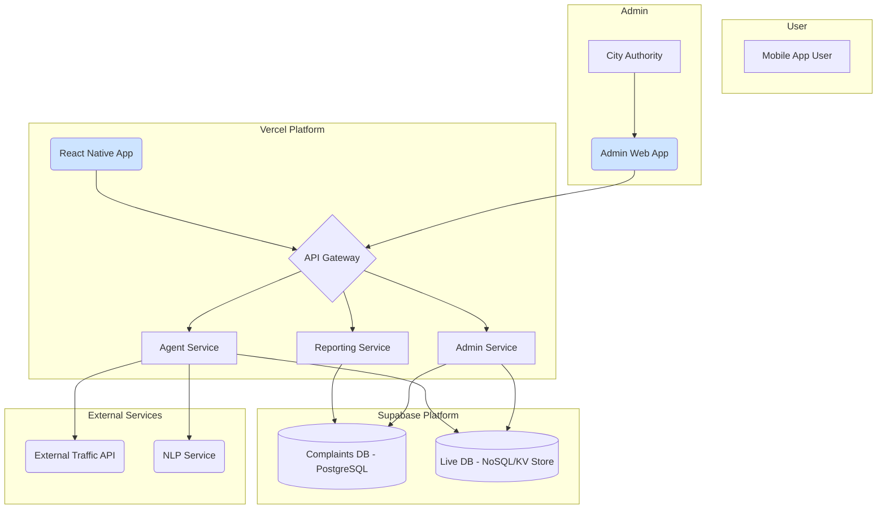

# 2. High Level Architecture

## 2.1. Technical Summary

The proposed architecture is a cloud-native, microservices-based system deployed within a monorepo. The frontend will be a native mobile application for iOS and Android, likely built with React Native, communicating with a backend via an API Gateway. The backend will consist of distinct services (e.g., `reporting-service`, `agent-service`, `admin-service`) running as serverless functions. Data will be segregated into a PostgreSQL database for transactional report data and a NoSQL database (like Redis or MongoDB) for fast-retrieval of live civic information. This design directly supports the PRD's goals by ensuring scalability, separation of concerns, and efficient, real-time data handling for the two distinct user-facing features.

## 2.2. Platform and Infrastructure Choice

**Recommendation:** Vercel + Supabase

*   **Option 1: Vercel + Supabase:**
    *   **Pros:** Excellent developer experience, seamless integration with Next.js/React Native, built-in serverless functions, managed PostgreSQL (Supabase), and integrated authentication. Ideal for rapid development and iteration.
    *   **Cons:** Can be more costly at extreme scale compared to raw AWS.
*   **Option 2: AWS Full Stack (Lambda, API Gateway, S3, Cognito, RDS):**
    *   **Pros:** Infinitely scalable, highly configurable, and powerful. The enterprise standard for cloud infrastructure.
    *   **Cons:** Significantly higher configuration complexity and a steeper learning curve. Slower initial development velocity.

**Rationale:** For this project, speed of development and a streamlined developer experience are critical. The Vercel/Supabase stack provides the best balance of power and simplicity, directly offering the core components required (Serverless Functions, PostgreSQL, Auth) with minimal configuration overhead.

**Platform:** Vercel (for hosting frontend and serverless functions) and Supabase (for PostgreSQL database, storage, and auth).
**Key Services:** Vercel Serverless Functions, Supabase PostgreSQL, Supabase Auth, Supabase Storage.
**Deployment Host and Regions:** Vercel (Global CDN), Supabase (To be selected based on primary user location, e.g., us-east-1).

## 2.3. Repository Structure

**Structure:** Monorepo
**Monorepo Tool:** Turborepo
**Package Organization:**
*   `apps/mobile`: The React Native mobile application.
*   `apps/admin-web`: The web-based admin dashboard.
*   `packages/api`: The shared API gateway and routing layer.
*   `packages/services/reporting`: The reporting microservice.
*   `packages/services/agent`: The agent microservice.
*   `packages/shared-types`: Shared TypeScript types and interfaces.
*   `packages/ui`: Shared UI components between mobile and web apps.

## 2.4. High Level Architecture Diagram

## 2.5. Architectural Patterns

- **Microservices:** Backend logic is split into independent services (`reporting`, `agent`, `admin`) to ensure separation of concerns and independent scalability. _Rationale:_ This aligns with the PRD's technical assumption and is essential for managing the distinct logic for issue reporting and the information agent.
- **API Gateway:** A single entry point (`/api`) that routes requests to the appropriate microservice. _Rationale:_ Simplifies the client-side code, centralizes authentication, and provides a single place for rate limiting and monitoring.
- **Monorepo:** All code (frontend, backend, shared packages) is stored in a single repository. _Rationale:_ Facilitates code sharing (especially types), simplifies dependency management, and streamlines cross-stack refactoring.
- **Repository Pattern:** Data access logic will be abstracted away from the business logic within each service. _Rationale:_ This enables easier testing and allows for future database migration flexibility.
- **Serverless Functions:** Backend services will be deployed as stateless, event-driven functions. _Rationale:_ This approach is cost-effective (pay-per-use), automatically scalable, and reduces infrastructure management overhead, aligning with the goal of using open-source and cost-effective solutions.
