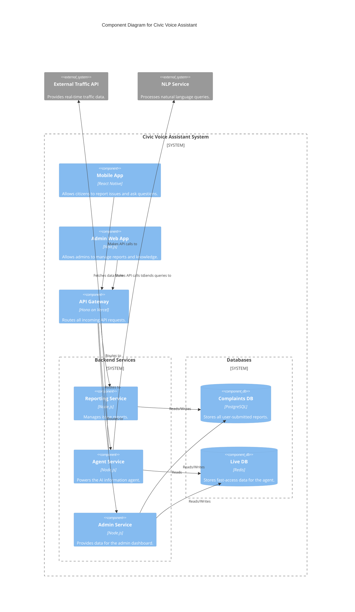

# 6. Components

This section identifies the major logical components of the full-stack application. Each component has a well-defined boundary and responsibility, which is crucial for a microservices-based architecture. This separation allows teams to work on different parts of the system independently.

## 6.1. Component List

### Mobile App
- **Responsibility:** The primary user-facing application for iOS and Android. It handles the UI for submitting reports and interacting with the AI agent.
- **Key Interfaces:** UI Screens, API Client (for backend communication).
- **Dependencies:** API Gateway, `shared-types` package.
- **Technology Stack:** React Native, TypeScript, Zustand, React Native Paper.

### Admin Web App
- **Responsibility:** A secure web dashboard for city authorities to log in, view/manage reports, and update the agent's knowledge base.
- **Key Interfaces:** UI Screens, API Client (for backend communication).
- **Dependencies:** API Gateway, `shared-types` package.
- **Technology Stack:** Next.js, React, TypeScript.

### API Gateway
- **Responsibility:** Acts as the single front door for all incoming API requests. It authenticates requests, routes them to the appropriate backend service, and aggregates responses.
- **Key Interfaces:** The public REST API specification.
- **Dependencies:** All backend services (Reporting, Agent, Admin), Supabase Auth.
- **Technology Stack:** Hono on Vercel Serverless Functions.

### Reporting Service
- **Responsibility:** Manages all business logic for issue reports. This includes creating new reports, updating their status, and triggering the AI analysis for categorization.
- **Key Interfaces:** An internal API consumed by the API Gateway.
- **Dependencies:** Complaints DB (PostgreSQL), AI Analysis Service (external or internal).
- **Technology Stack:** Node.js/TypeScript, Hono, PostgreSQL client.

### Agent Service
- **Responsibility:** Powers the AI assistant. It processes natural language queries from users, fetches data from the Live DB (Redis), and integrates with external services like the Traffic API and NLP service.
- **Key Interfaces:** An internal API consumed by the API Gateway.
- **Dependencies:** Live DB (Redis), External Traffic API, NLP Service.
- **Technology Stack:** Node.js/TypeScript, Hono, Redis client.

### Admin Service
- **Responsibility:** Contains the business logic required by the Admin Web App, such as fetching lists of reports and managing the `KnowledgeArticle` content in the Live DB.
- **Key Interfaces:** An internal API consumed by the API Gateway.
- **Dependencies:** Complaints DB (PostgreSQL), Live DB (Redis).
- **Technology Stack:** Node.js/TypeScript, Hono, PostgreSQL client, Redis client.

## 6.2. Component Diagram

This diagram illustrates the high-level relationships between the core components of the system.

