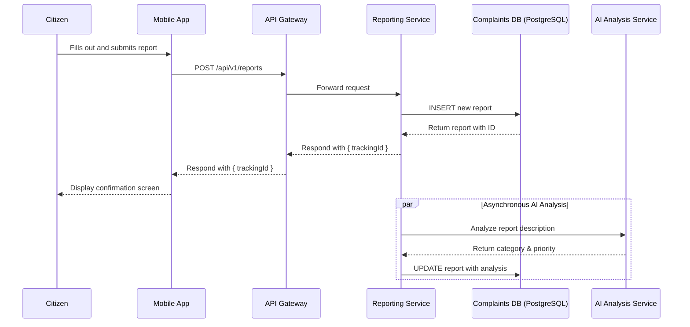
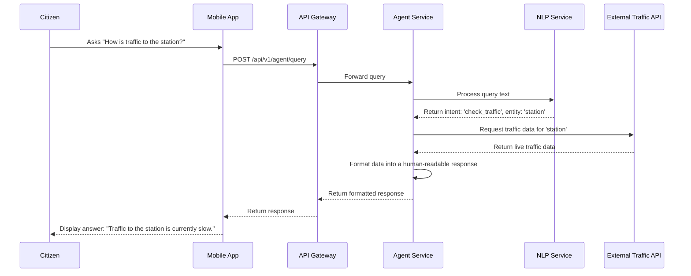

# 8. Core Workflows

This section provides sequence diagrams to illustrate the step-by-step interactions between components for the system's most critical user journeys. These diagrams are essential for understanding how data flows through the system to fulfill a user's request.

## 8.1. Workflow 1: New Issue Submission

This diagram shows the flow of a citizen submitting a new issue report, from the mobile app to the database, including the asynchronous AI-powered analysis.

## 8.2. Workflow 2: Agent Traffic Query

This diagram illustrates how the AI agent processes a user's question about traffic, involving the NLP service and the external traffic data provider.

